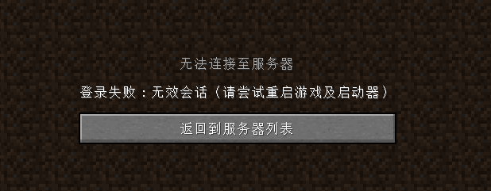

# 常见问题

## Q: 为什么我登陆时出现了“登陆失败：无效会话”的错误？

可能是mc认证协议yggdrasil在处理登陆时出现问题，请尝试重新进入服务器几次，无需重启客户端或启动器

<red>若多次未解决问题，请重新登录账号并启动游戏</red>

## Q: 为什么我用服务器群文件夹的客户端进去后显示英文
可能是由于你没解压,需要将客户端进行解压后再启动

## Q: 我游戏密码忘记了怎么办?重新创号?
可联系管理进行密码修改

## Q: 为什么我玩游戏左下角有个图标？
可能是不能语音的图标，你没有使用群内的客户端，群内客户端只是提供语音功能

## Q: 为什么ip正常输入，还是显示红色无法链接？
尝试直接双击连接,或者是服务器正在维护

服务器IP为：chenjia.one

## Q: 为什么没法装光影?是服务器不支持吗
支持的,所有服务器均支持,只是你需要下载可以使用光影的客户端然后在游戏内启用

光影目录 : .minecraft\shaderpacks

材质目录 : .minecraft\resourcepacks

均不需要解压,但是你客户端得解压！！！,把网上下载的塞进去后在游戏内进行启用

## Q: 为什么我看别人的皮革甲不能正常显示?
可能是因为你装了光影，服务器插件限制原因皮革盔甲不能正常显示外观。。。关闭光影即可不影响使用

## Q: 为什么我的名字里有**？能不能去掉?
不可以，这是防脏话系统，服务器致力于打造和谐社区，任何辱骂脏话都不被允许，你只能改名字

## Q: java17怎么下载?
下载群里的jdk-17.xxx 解压以后将文件夹直接放到C盘java文件夹下面，如果没有，则自己创建java文件夹，然后在登入器中选择java路径
