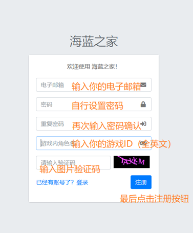
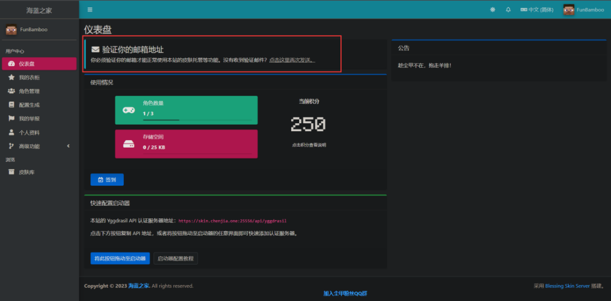
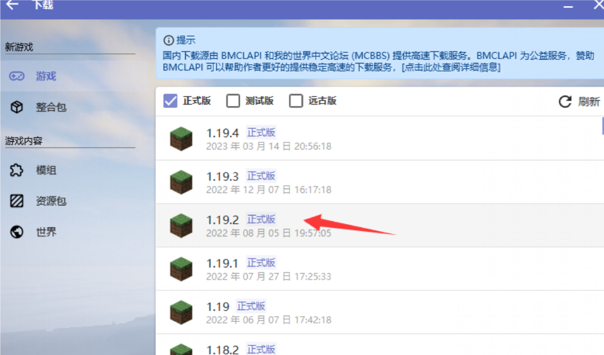
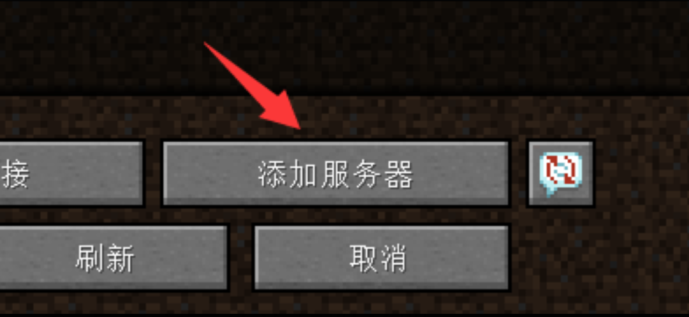

# 如何进服 ？
## 一 注册账号
## 如果你有正版，可以直接通过正版进入  
1. 注册皮肤站账号，皮肤站地址:[海蓝之家皮肤站](https://skin.chenjia.one:25556/)  
  
2. 在注册界面注册账号  
  
1. 进入皮肤站你会看到一个邮箱验证  

如果你没有看到邮件，可以点击再次发送  
  
打开链接后把你注册时的邮箱填入进去即可  
## 二 启动器配置  
服务器是 Java 版的，最好是采用电脑来玩，当然手机也可以，可以通过以下方式下载启动器：  
手机版：[点击打开](https://www.123pan.com/s/0cC7Vv-2Lcov.html) 提取码:1145  
电脑版: ①[PCL启动器](https://afdian.net/p/0164034c016c11ebafcb52540025c377) ②[HMCL启动器](https://hmcl.huangyuhui.net/download/)  
其中，手机版的教学可以参考 HMCL 启动器的教学，游玩技巧可以看：
[哔哩哔哩](https://www.bilibili.com/video/BV19v4y167q9)  
### 1. PCL2 启动器教学
如果你是 PCL2 启动器，下载解压之后打开文件。  
  

请使用1.19.2来游玩服务器，如果你选择了更高的版本，可以自行安装模组向下兼容。  
如果你是萌新，直接点击，再开始安装即可。如果你是老玩家，推荐安装 Fabric  
安装完毕之后，点击上方启动，再点击下面的版本设置，再点击设置。  
使用鼠标滚轮找到服务器选项卡  
登录方式，选择第三方登录  
认证服务器填写: https://skin.chenjia.one:25556/api/yggdrasil  
注册链接填写: https://skin.chenjia.one:25556/auth/register  
不要点下面那个设置为 LittleSkin 哦！
  
  
### 2. HMCL 启动器教学  

如果你是 HMCL 启动器，可以按照如下操作：
点击左侧菜单栏下载，选择 1.19.2 的游戏版本。

如果你是萌新，直接点击，再开始安装即可。如果你是老玩家，推荐安装 Fabric  

打开启动器，点击左上角的账户  

点击右下角添加认证服务器，并填写如下服务器地址【 https://skin.chenjia.one:25556/api/yggdrasil 】，点击下一步，点击完成。  
  
### 3. 添加服务器地址开始愉快的玩耍叭~  

① 进入游戏之后，点击多人游戏  

② 点击右下角添加服务器
  
③ 填写如下内容，点击完成  
 new.chenjia.one
  
④ 刷新一下页面，双击进入服务器~  

